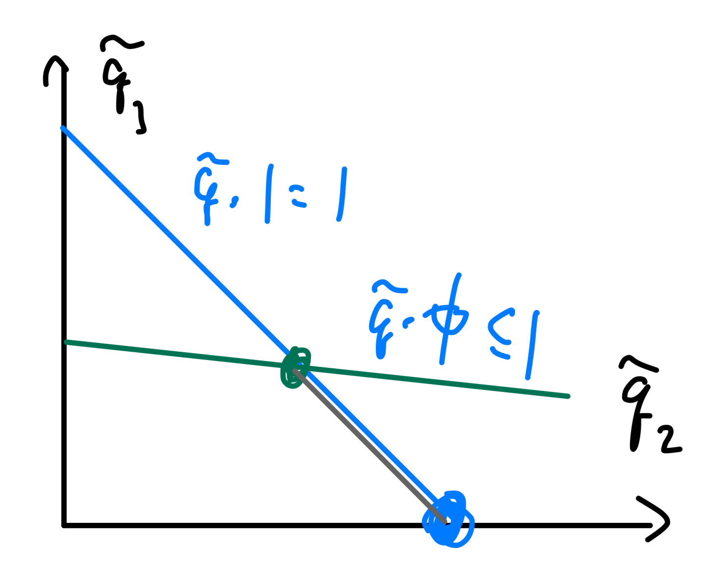

# f-Divergence 

Key takeaways: 

1. $f$-divergence is equivalent modulo $c(t-1)$; 
    convexity plus $f(1)=f'(1)=1$ (which implies $f\geq 0$) implies locally $\chi^2$.
2. Convexity of $D_f$ \@ref(thm:fInfoProperties) $\iff$ 
    DPI \@ref(thm:fDPI) $\iff$ 
    monotonicity \@ref(thm:fMonotonicity) $\iff$ convexity of $f$. 
3. There is no chain rule for $f$-divergences other than 
    KL-divergence. Rényi divergence enjoys tensorization and chain rule (up to tilting); 
    it includes KL, $\chi^2$ and Hellinger as special cases. 
4. TV as binary hypothesis testing: to reason about TV, break spaces 
    into $dP>dQ$ and $dP<dQ$. 
5. Several divergences are metrics (JS, $H^2$); one fast way to 
    compare is to compare to metric, use triangle inequality, 
    then use comparison inequality again. 
5. TV does not enjoy tensorization properties; 
    Hellinger divergence is both a metric and tensorizes well. 
6. A powerful approximation theorem \@ref(thm:fFiniteApprox) 
    reduces arbitrary spaces to finite ones. Similarly, 
    the Harremoës-Vajda theorem \@ref(thm:harremoesVajda) 
    concludes the problem of joint range. 

Locality and Fisher information:

1. Most $f$-divergences (with bounded $f''$) are locally $\chi^2$: 
    theorem \@ref(thm:localChiExpansion) <u>with respect to mixture 
    interpolations</u>. 
2. Fisher information is only defined <u>with respect to a 
    family of distributions</u> parameterized by $\theta$. 
    - It is the expectation of the Hessian of the log-pdf about $\theta$: 
    equation \@ref(eq:fisherHessian). 
    - For regular families, $\chi^2$ 
    (mixture interpolations, in particular) is locally determined 
    by the Fisher information \@ref(thm:localFisherDiv).
3. Fisher information matrix is non-negative, monotonic, has its own 
    chain rule \@ref(prp:fisherChainRule) and variational characterization. 


## Definition {-}

:::{.definition name="f-divergence"}
Given a convex function $f:(0, \infty)\to \R$ with $f(1)=0$, 
    for every two probability distributions over 
    $\mca X$, if $P\ll Q$ then the $f$ divergence is 
    \[ 
        D_f(P\|Q) = \Exp_Q \left[
            f\left(\df{dP}{dQ}\right)
        \right]
    \] 
    Here $f(0) = f(0_+)$ per limit. More generally, 
    define $f'(\infty) = \lim_{x\to 0^+} xf(1/x)$, 
    we have 
    \[ 
        D_f(P\|Q) = \int_{q>0} q(x) f\left[
            \df{p(x)}{q(x)} 
        \right] \, d\mu + f'(\infty) P[Q=0]
    \] 
    this last generalization is needed to account for 
    divergences like total variation. 
    Intuitively, sums for terms with $dQ=0$ are like 
    \[ 
        \int_{dQ=0} dQ f\left(\df{dP}{dQ}\right) 
        = \lim_{t=dP/dQ\to 0^+} \int \df {dP}{t} f(1/t)
    \] 
:::

Examples of $f$-divergences: 

1. **KL-divergence**: $f(x)=x\log x$ to recover KL-divergence. 
2. **Total variation (TV)**: $f(x) = \df 1 2 |x - 1|$: 
\[ 
    \TV(P, Q) = \df 1 2 \Exp_Q \left|\df{dP}{dQ} - 1\right| 
    = \df 1 2 \int |dP - dQ| = 1 - \int d(P\wedge Q)
\] 
Recall that $P\wedge Q$ is the pointwise minimum measure 
so $\int d(P\wedge Q)$ is the overlap measure. 
3. **$\chi^2$-divergence**: $f(x)=(x-1)^2$. 
\[ 
    \chi^2(P\|Q) = \Exp_Q \left(\df{dP}{dQ} - 1\right)^2 
    = \int \df{(dP - dQ)^2}{dQ} 
    = \int \df{dP^2}{dQ} + dQ - 2dP = \int \df{dP^2}{dQ} - 1
\] 
4. **Squared Hellinger distance**: $f(x) = \left(1 - \sqrt x\right)^2$. 
\[ 
    H^2(P, Q) = \int \left(\sqrt{dP} - \sqrt{dQ}\right)^2 
    = 2 - 2\int \sqrt{dPdQ}
    (\#eq:hellingerDiv)
\] 
The quantity $B(P, Q) = \int \sqrt{dPdQ}$ is the 
**Bhattacharyya coefficient** (Hellinger affinity). 
Note that $H(P, Q) = \sqrt{H^2(P, Q)}$. 
The Hellinger distance is $H(P, Q) = \sqrt{H^2(P, Q)}$. 
5. **Le Cam divergence**: $f(x) = \df{1-x}{2x+2}$, 
\[ 
    \LC(P, Q) = \df 1 2 \int \df{(dP - dQ)^2}{dP + dQ}
\] 
The square root $\sqrt{\LC(P, Q)}$, the Le Cam distance, 
is a metric. 
6. **Jensen-Shannon divergence** take 
$f(x) = x\log \df{2x}{x+1} + \log \df 2 {x+1}$. 
\[ 
    \JS(P, Q) = D\left(P \| \df{P+Q}{2}\right) 
    + D\left(Q \| \df{P+Q}{2}\right)
\] 

:::{.proposition}
$\TV(P, Q) = \df 1 2 \int |dP - dQ| = 1 - \int d(P\wedge Q)$. 
:::
<details>
<summary>Proof</summary>
_Proof:_ Let $E = \{x:dP > dQ\}$, then 
\begin{align}
    \int |dP - dQ| 
    &= \int_E dP - d(P\wedge Q) + \int_{E^c} dQ - d(P\wedge Q)
    = \int_E dP + \int_{E^c} dQ - \int d(P\wedge Q) \\ 
    &= \int_E dP + \int_{E^c} d(P\wedge Q)_{=dP} + \int_{E^c} dQ + \int_E d(P\wedge Q)_{=dQ} 
    - 2\int d(P\wedge Q) \\ 
    &= 2 - 2\int d(P\wedge Q)
\end{align}
</details>


:::{.proposition}
The following quantities derived from divergences are 
metrics on the space of probability distributions
\[ 
    \TV(P, Q), \quad H(P, Q), \quad \sqrt{\JS(P, Q)}, \quad \sqrt{\LC(P, Q)}
\] 
:::

:::{.proposition name="closure properties"}

1. $D_f(Q \| P) = D_g(P \|Q)$ for $g(x) = xf(1/x)$. 
2. $D_f(P\|Q)$ is a $f$-divergence, then 
\[ 
    D_f(\lambda P + \bar \lambda Q \|Q), \quad 
    D_f(P \| \lambda P + \bar \lambda Q), \quad 
    \forall \lambda\in [0, 1]
\] 
are $f$-divergences. 
3. Linearity: $D_{f+g} = D_f + D_g$. 
4. Distinguishability: $D_f(P \| P) = 0$ 
:::
<details>
<summary>Proof</summary>
For the first claim, 
\[ 
    D_g(P \|Q) = \int dQ \left(\df{dP}{dQ}\right) f\left(\df{dQ}{dP}\right) 
    = D_f(Q \| P)
\] 
For the second claim, the other case can be obtained by using the equation above. 
\[ 
    D_f(\lambda P + \bar \lambda Q \|Q) 
    = \int dQ f\left(\lambda \df{dP}{dQ} + \bar \lambda\right)
    \implies \tilde f(x) = f\left(\lambda x + \bar \lambda\right)
\] 
</details>

:::{.proposition #fEquivProperties name="equivalence properties"}

1. $D_f(P\|Q) = 0$ for all $P\neq Q$ iff $f(x)=c(x-1)$ for some $c$. 
2. $D_f = D_{f+c(x-1)}$; thus we can always assume $f\geq 0$ and $f'(1)=0$. 
:::
<details>
<summary>Proof</summary>
Claim $1$ proceeds by computation (assuming continuity) 
\[ 
    D_f(P \|Q) = c \int (dP / dQ - 1) dQ = 0 
\] 
This means that $c(x-1)$ is in the kernel of the linear operator 
$f\mapsto D_f$. Pick $c=-f'(1)$, then $f(1)=f'(1)=0$; by convexity $f\geq 0$. 
</details>


:::{.proposition #specialfMonotonicity name="special case of monotonicity"}
<span style="color:green">
Joint divergence is unchanged through the same channel 
</span>
\[ 
    D_f(P_XP_{Y|X} \| Q_XP_{Y|X}) = D_f(P_X \| Q_X)
\] 
in particular, for the source-agnostic channel we have 
\[ 
    D_f(P_XP_Y \| Q_XP_Y) = D_f(P_X \| Q_X)
\] 
:::

<details>
<summary>Proof</summary>
Direct computation 
\begin{align}
    D_f(P_XP_{Y|X} \| Q_XP_{Y|X}) 
    &= \int Q_X(x) dx \int P_{Y|X=x}(y)dy\, 
    f\left[\df{P_X(x) P_{Y|X=x}(y)}{Q_X(x) Q_{Y|X=x}(y)}\right]\\ 
    &= \int Q_X(x) dx f\left(\df{P_X(x)}{Q_X(x)}\right)
    = D_f(P_X \| Q_X)
\end{align}
</details>

## Information properties, MI {-}

:::{.theorem #fMonotonicity name="monotonicity"}
The joint is more distinguishable than the marginal: 
\[ 
    D_f(P_{XY} \| Q_{XY}) \geq D_f(P_X \| Q_X)
\] 
inequality is saturated when $P_{Y|X} = Q_{Y|X}$. 
:::

<details>
<summary>Proof</summary>
Assume $P_{XY} \ll Q_{XY}$, then expand and 
apply Jensen's inequality 
\begin{align}
    D_f(P_{XY} \| Q_{XY}) 
    &= \Exp_{X\sim Q_X} \Exp_{Y\sim Q_{Y|X}} f\left(
        \df{dP_{Y|X} P_X}{dQ_{Y|X}Q_X}
    \right)
    \geq \Exp_{X\sim Q_X} f\left(\Exp_{Y\sim Q_{Y|X}}
        \df{dP_{Y|X} P_X}{dQ_{Y|X}Q_X}
    \right) \\ 
    &\geq \Exp_{X\sim Q_X} f\left(
        \df{dP_X}{dQ_X}
    \right) = D_f(P_X \| Q_X)
\end{align}
To be more careful, on the first line we have 
\begin{align}
    \Exp_{Y\sim Q_{Y|X=x}}
        \df{P_{Y|X=x}(y) P_X(x)}{Q_{Y|X=x}(y)Q_X(x)}
    &= \df{P_X(x)}{Q_X(x)} \sum_y 
    Q_{Y|X=x}(y) \df{P_{Y|X=x}(y)}{Q_{Y|X=x}(y)}
    = \df{P_X(x)}{Q_X(x)}
\end{align}
Inequality is saturated when, for every $x$, 
$P_{Y|X=x}=Q_{Y|X=x}$. 
</details>

:::{.definition name="conditional f-divergence"}
Given $P_{Y|X}, Q_{Y|X}$ and $P_X$, the conditional 
$f$-divergence is 
\[ 
    D_f(P_{Y|X} \| Q_{Y|X} | P_X) 
    = D_f(P_{Y|X} P_X \| Q_{Y|X} P_X) 
    = \Exp_{x\sim P_X}\left[
        D_f(P_{Y|X=x}\| Q_{Y|X=x})
    \right]
\] 
:::
<details>
<summary>Proof</summary>
The second statement requires some justification: 
\begin{align}
    D_f(P_{Y|X} P_X \| Q_{Y|X} P_X) 
    &= \Exp_{x\sim P_X} 
    \Exp_{y\sim Q_{Y|X=x}}\left[
        f\left(\df{P_{Y|X=x}(y)}{Q_{Y|X=x}(y)}\right)
    \right]
\end{align}
</details>


:::{.theorem #fDPI name="data-processing inequality"}
Given a channel $P_{Y|X}$ with two inputs $P_X, Q_X$ 
\[ 
    D_f(P_{Y|X} 
    \circ P_X \| P_{Y|X} \circ Q_X) 
    \leq D_f(P_X \| Q_X)
\] 
:::
<details>
<summary>Proof</summary>
$D_f(P_X \| Q_X) = D_f(P_{XY} \| Q_{XY}) \geq D_f(P_Y \| Q_Y)$, 
with two equalities given by proposition \@ref(prp:specialfMonotonicity) 
and theorem \@ref(thm:fMonotonicity). Inequality 
is saturated by the monotonicity condition $P_{X|Y} = Q_{X|Y}$. 
</details>


:::{.theorem #fInfoProperties name="information properties of f-divergences"}

1. <span style="color:blue">Non-negativity</span>: $D_f(P\|Q) \geq 0$. If $f$ is _strictly convex_ 
    at 1, i.e. 
    \[ 
        \forall s, t\in [0, \infty), \alpha \in (0, 1) \text{ with }
        \alpha s + \bar \alpha t = 1: \quad \alpha f(s)+ \bar \alpha f(t) 
        > f(1) = 0
    \] 
    then $D_f(P\|Q) = 0 \iff P=Q$. 
2. <span style="color:blue">Conditional $f$-divergence; conditioning increases divergence</span>: 
    $D_f(P_{Y|X} \circ P_X \| Q_{Y|X} \circ P_X) \leq D_f(P_{Y|X} \| Q_{Y|X} | Q_X)
        = D_f(P_{Y|X} P_X \| Q_{Y|X} P_X)$. 
3. <span style="color:blue">Joint-convexity</span>: $(P, Q)\mapsto D_f(P\|Q)$ is jointly convex; 
    consequently, $P\mapsto D_f(P\|Q)$ and $Q\mapsto D_f(P\|Q)$ 
    are also convex. 
:::
<details>
<summary>Proof</summary>
For non-negativity, apply monotonicity to 
\[ 
    D_f(P_X \| P_Y) = D_f(P_{X, 1} \| P_{Y, 1}) \geq D_f(1 \| 1) = 0
\] 
Assume $P\neq Q$ so there exists measurable $A$ such that 
$P[A]=p \neq Q[A] = Q$, then apply the $\chi_A$ channel and apply DPI; 
both cases $q=1$ and $q\neq 1$ contradict strict convexity. 
Claim (2) follows from monotonicity and recognize $P_{Y|x}\circ P_X$ as the 
marginal of $P_{Y|X}P_X$. 
Joint convexity follows from standard latent variable argument: 
to prove joint convexity 
\[ 
    D(\lambda P_0 + \bar \lambda P_1 \| Q_0 + \bar \lambda Q_1) 
    \leq \lambda D(P_0 \| Q_0) + \bar \lambda D(P_1 \| Q_1)
\] 
Take $\theta \sim \mrm{Ber}_\lambda \to (P, Q)$, then the RHS is 
$D(P_{P|\lambda} \| P_{Q|\lambda} | P_\lambda)$ while the LHS 
is $D(P_{P|\lambda}\circ P_\lambda\| P_{Q|\lambda} \circ P_\lambda)$

The following powerful theorem allows us to reduce any general 
problem to finite alphabets. 
</details>

:::{.theorem #fFiniteApprox name="finite approximation theorem"}
Given two probability measures $P, Q$ on $\mca X$ with $\sigma$-algebra 
$\mca F$. Given a finite $\mca F$-measurable partition 
$\mca E = \{E_1, \cdots, E_n\}$, define the distribution $P_{\mca E}$ 
on $[n]$ by $P_{\mca E}(j) = P[E_j]$, similarly for $Q$, then 
\[ 
    D_f(P\|Q) = \sup_{\mca E} D_f(P_{\mca E} \| Q_{\mca E})
\] 
where $\sup$ is over all finite $\mca F$-measurable partitions. 
:::
We omit the technical proof above. 

:::{.definition name="f-information"}
The $f$-information is defined by 
\[ 
    I_f(X; Y) = D_f(P_{XY} | P_XP_Y)
\] 
:::

:::{.definition name="f-DPI"}
For $U\to X\to Y$, we have $I_f(U; Y) \leq I_f(U; X)$.
:::
Proof: $I_f(U; X) = D_f(P_{UX} \|P_UP_X) \geq 
D_f(P_{UY} \| P_UP_Y) = I_f(U; Y)$. 


## TV and Hellinger, hypothesis testing {-}

In a _binary hypothesis testing_ problem, one is 
given an observation $X$, which is known to be $X\sim P$ 
or $X\sim Q$. The goal is to decide $\lambda\in \{0, 1\}$ 
based on $X$. In other words, 
\[ 
    \lambda \to X\to \hat \lambda 
\] 
Our objective is to find a possibly randomized 
decision function $\phi:\mca X\to \{0, 1\}$ such that 
\[ 
    P[\phi(X)=1] + Q[\phi(X) = 0]
\] 
is minimized. We will see that optimization leads to TV, while 
asymptotic tensorization leads to $H^2$. 


:::{.theorem #tvVarChar name="variational characterizations of TV"}

1. $\sup$-representation: let 
$\mca F = \{f:\mca X\to \mbb R, \|f\|_\infty \leq 1\}$, then 
\[ 
    \TV(P, Q) = \sup_E P(E) - Q(E) = \df 1 2 \sup_{f\in \mca F} 
    \left[\Exp_P f(X) - \Exp_Q f(X)\right]
\] 
Supremum is achieved by $f=\chi_E$, where $E=\{x:p(x)>q(x)\}$. 
2. $\inf$-representation: Provided the diagonal is measurable, 
\[ 
    \TV(P, Q) = \min_{P_{XY}} \{P_{XY}[X\neq Y]
    \text{ subject to } P_X=P, P_Y=Q\}
\] 
:::
<details>
<summary>Proof</summary>
The upper bound by $\TV$ is intuitive; 
to demonstrate saturation, let $E = \{x:p(x)>q(x)\}$, then 
\begin{align}
    0 = \int [p(x) - q(x)]\, d\mu 
    &= \int_E + \int_{E^c} [p(x) - q(x)]\, d\mu  \\ 
    \int_E [q(x) - p(x)]\, d\mu 
    &= \int_{E^c} [p(x) - q(x)]\, d\mu 
\end{align}
The sum of these two integrals (note the definition of $E$) 
equals $2\TV$, then 
\[ 
    \TV(P, Q) = \df 1 2 \int \chi_E[(q(x) - p(x)]\, d\mu 
    = \df 1 2 \Exp_P \chi_E(X) - \Exp_Q \chi_E(X)
\] 
For the $\inf$ representation, given any coupling $P_{XY}$, 
for $f\in \mca F$ we have 
\[ 
    \Exp_P f(X) - \Exp_Q f(X) 
    = \Exp_{P_{XY}}[f(X) - f(Y)] 
    \leq 2 P_{XY}[X\neq Y]
\] 
This shows that the $\inf$-representation is always an 
upper bound; 
<span style="color:green">
we obtain saturation when $X\neq Y$ only happens for 
possible values of $X$ disjoint from possible values of $Y$, 
and $f$ is the indicator function 
on the disjoint support. 
</span>
This is satisfied by the following 
construction given $P, Q$: 

1. Let $\pi = \int \pi(x)\, d\mu$ denote the overlap scalar, where 
$\pi(x) = \min(p(x), q(x))$. 
2. With probability $\pi$ take $X=Y$ sampled from the overlap density 
\[ 
    r(x) = \df 1 \pi \pi(x)
\] 
3. With probability $1-\pi$ sample $X, Y$ independently from 
\[ 
    p_1(x) = \df {p(x) - \pi(x)} {1 - \pi}, \quad 
    q_1(x)=\df {q(x) - \pi(x)}{1 - \pi}
\] 
```{r echo=FALSE, fig.align='center', out.width='80%', fig.cap="Visual representation of joint construction."}
  knitr::include_graphics("images/tvInf.jpeg") 
```

Note that $p_1, q_1$ have disjoint supports. 
Now, the marginals are indeed $P, Q$, and this saturates 
the inequality since $P_{XY}[X\neq Y] = 1-\pi=\TV(P, Q)$
</details>

The total variation distance does not tensorize well, 
but we have the following sandwich bound: 
\[ 
    \df 1 2 H^2 \leq \TV \leq 
    H\sqrt{1 - \df{H^2}{4}} \leq 1
    (\#eq:TVHellingerBound)
\]  
We also have the following asymptotic theorem: 

:::{.theorem name="asymptotic equivalence of TV and Hellinger"}
For any sequence of distributions $P_n, Q_n$ 
\begin{align}
\TV(P_n^{\otimes n}, Q_n^{\otimes n}) \to 0 
&\iff H^2(P_n, Q_n) = o(1/n) \\ 
\TV(P_n^{\otimes n}, Q_n^{\otimes n}) \to 1
&\iff H^2(P_n, Q_n) = \omega(1/n) 
\end{align}
Recall that $o(1/n)$ means asymptotically smaller growth 
than $1/n$, while $\omega(1/n)$ is the opposite. 
:::
<details>
<summary>Proof</summary>
We will need the following tensorization 
result from corollary \@ref(cor:renyiTensorCor): 
\[ 
    H^2_n = 2 - 2\left(1 - \df 1 2 H^2_1\right)^n 
    \approx 2 - 2\exp\left[-n\left(1 - \df 1 2 H^2_1\right)\right]
\] 
Using the sandwich bound \@ref(eq:TVHellingerBound), 
$\TV\to 0$ implies the exponential going to $0$, 
then $H^2_1$ has to grow slower than $1/n$. 
The oppose is true for $\TV\to 1$. 
</details>

## Joint range {-}

We first provide a special case of an inequality. 

:::{.theorem name="Pinsker's inequality"}
For any two distributions, 
$D(P\|Q) \geq (2\log e) \TV(P, Q)^2$ 
:::
<details>
<summary>Proof</summary>
By DPI, it suffices to consider 
Bernoulli distributions via the channel $1_E$ 
which results in Bernoulli with parameter 
$P(E)$ or $Q(E)$. Working in natural units, 
Pinsker's inequality 
for Bernoulli distributions yield 
\[ 
    \sqrt{\df 1 2 D(P\|Q)} 
    \geq \TV(1_E\circ P, Q_E\circ Q) = 
    |P(E) - Q(E)|
\] 
Taking supremum over all $E$ yields 
the desired inequality per the TV 
variational characterization theorem \@ref(thm:tvVarChar). 
</details>


:::{.definition name="joint range"}
Given two $f$-divergences $D_f$ and $D_g$, their 
joint range $\mca R\subset [0, \infty]^2$ 
is defined by 
\[ 
    \mca R = \mrm{Image}\left[
        (P, Q)\mapsto (D_f(P\|Q, D_g(P\|Q))
    \right]
\] 
The joint range over $k$-ary distribution is denoted $\mca R_k$. 
:::

Our next result will characterize the set of 
$f$-divergences. 

:::{.lemma #convexBoundaryThm name="Fenchel-Eggleston-Carathéodory theorem"}
Let $S\subset \R^d$ and $x\in \mrm{co}(S)$. There exists 
a set of $d+1$ points $S'=\{x_1, \cdots x_{d+1}\}\in S$ 
such that $x\in \mrm{co}(S')$. If $S$ has at most 
$d$ connected components, then $d$ points are enough. 
:::

As a corollary of the following theorem, it 
suffices to prove joint range for Bernouli, then 
convexify the range. 

:::{.theorem #harremoesVajda name="Harremoës-Vajda"}
$\mca R = \mrm{co}(\mca R_2) = \mca R_4$
where $\mrm{co}$ denotes the convex hull with 
a natural extension of convex operations to 
$[0, \infty]^2$. In particular, 

1. $\mrm{co}(\mca R_2) \subset\mca R_4$: 
    standard latent variable argument. 
2. $\mca R_k \subset \mrm{co}(\mca R_2) = \mca R_4$. 
3. $\mca R = \mca R_4$: the approximation 
    theorem already implies $\mca R = \overline{\bigcup_k \mca R_k}$; 
    the closure is technical. 
:::
<details>
<summary>Proof</summary>
First consider claim $1$. 
Construct a convex divergence as follows: 
for two pairs of distributions $(P_0, Q_0)$ and 
$(P_1, Q_1)$ on $\mca X$ and $\lambda \in [0, 1]$. 
Define the typical Bernoulli latent joint $(X, B)$ 
by $P_B = Q_B = \mrm{Ber}(\alpha)$ and $(P, Q)_{X|B=j} = (P_j, Q_j)$. 
Applying the conditional divergence to obtain 
\[ 
    D_f(P_{XB} \| Q_{XB}) 
    = \bar \alpha D_f(P_0\|Q_0) + \alpha D_f(P_1 \| Q_1) 
    \implies \mrm{co}(\mca R_2)\subset \mca R_4 
\] 
Onto the most nontrivial claim $2$: fixing $k$ and 
distributions $P, Q$ on $[k]$ with distributions $(p_j), (q_j)$, 
w.l.o.g. make $q_{j>1}>0$ and concentrate $q_1=0$ (i.e. concentrate 
all empty points onto $j=1$.
<span style="color:blue">
Consider the equivalence class $\mca S$ of all 
$(\tilde p_j, \tilde q_j)$ <u>which have the same likelihood ratio 
on the support</u> of $q$: 
</span>
Let $\phi_{j>1} = p_j / q_j$ and consider 
\[ 
    \mca S = \left\{
        \tilde Q = (\tilde q_j)_{j\in [k]}: 
        \tilde q_j\geq 0, \sum \tilde q_j=1, \tilde q_1=0, 
    \right\}
\] 
Note that $\mca S$ it the intersection of 

1. The simplex of all distributions $\tilde q$. 
2. The half-space specified by $\tilde q\cdot \phi \leq 1$. 

We can next identify the boundary of $\mca S_e\subset \mca S$: 

1. $\tilde q_{j\geq 2}=1$ and $\phi_j\leq 1$. 
2. $\tilde q_{j_1}+\tilde q_{j_2}=1$ and 
    $\tilde q_{j_1}\phi_{j_1} + \tilde q_{j_2}\phi_{j_2}=1$. 

```{r echo=FALSE, fig.align='center', out.width='50%', fig.cap="Gray line corresponds to $S$; blue and green dots correspond to elements of $S_e$ identified by (1) and (2), respectively. "}
   
```

We next have $\mca S = \mrm{co}(\mca S_e)$; so for $Q$, 
there exists extreme points $\tilde Q_j\in \mca S_e$ 
(note that $\mca S_e$ is dependent upon $Q$!) with support on 
at most $2$ atoms (binary distributions) such that 
$Q = \alpha_j \tilde Q_j$. 
The map asspciating $\tilde P$ given $\tilde Q$ is 
\[ 
    \tilde p_j = \begin{cases}
        \phi_j \tilde q_j & j\in \{2, \cdots, k\}, \\ 
        1 - \sum_{j=2}^k \phi_j \tilde q_j & j = 1
    \end{cases}
\] 
On this particular set which fixes the likelihood ratio, 
the divergence is an affine map: 
\[ 
    \tilde Q \mapsto D_f(\tilde P \| \tilde Q) 
    = \sum_{j\geq 2}\tilde q_j f(\phi_j) + f'(\infty)\tilde p_1 \implies 
    D_f(P\|Q) = \sum_{j=1}^m \alpha_i D_f(\tilde P_i \|\tilde Q_i)
\] 

</details>


We defer detailed examples of joint ranges to the book (7.6). 


## Rényi divergence {-}

The Rényi divergences are a monotone transformation 
of $f$-divergences; they satisfy DPI and other properties. 

:::{.definition name="Rényi divergence"}
For $\lambda\in \R - \{0, 1\}$, the Rényi divergence 
of order $\lambda$ between distributions $P, Q$ is 
\[ 
    D_\lambda(P \| Q) = \df 1 {\lambda - 1} \log \Exp_Q \left[
        \left(\df{dP}{dQ}\right)^\lambda
    \right]
\] 
:::
To see its connection with entropy, note that 
\[ 
    \Exp_Q \left(\df{dP}{dQ}\right)^\lambda 
    = \mrm{sgn}(\lambda - 1) D_f(P\|Q) + 1, \quad f = \mrm{sgn}(\lambda - 1)(x^\lambda - 1)
\] 
with which the Rényi entropy becomes (the $\mrm{sgn}(\lambda - 1)$ is just there 
to keep $f$ convex): 
\[ 
    D_\lambda(P\|Q) = \df 1 {\lambda - 1} \log \left[1 + 
        \mrm{sgn}(\lambda - 1) D_f(P\|Q)
    \right], \quad f = \mrm{sgn}(\lambda - 1)(x^\lambda - 1)
    (\#eq:renyiMonotone)
\] 

:::{.proposition}
Under regularity conditions, 
\[ 
    \lim_{\lambda \to 1} D_\lambda (P \|Q) = D(P \| Q)
\] 
:::
<details>
<summary>Proof</summary>
Expand $(d_QP)^\lambda = \exp(\lambda \ln d_QP)$ about $\lambda=1$: 
\[ 
    (d_QP)^{\lambda} \approx d_QP + \ln d_QP \cdot d_QP \cdot (\lambda - 1)
\] 
Taking $\Exp_Q$ yields $1 + (\lambda - 1)\Exp_P[\ln d_QP]$; then 
substituting into $\log x \approx 1+x$ yields 
\[ 
    D_{\lambda_\to 1}(P \| Q) = \df 1 {\lambda - 1} \log \left[
        1 + (\lambda - 1)\Exp_P[\ln d_QP]
    \right]
    = \Exp_P \ln d_QP = D(P \| Q)
\] 
</details>

:::{.proposition #specialRenyi name="special cases of Rényi divergence"}
Consider $\lambda = 1/2, 2$: 
\[ 
    D_2 = \log(1 + \chi^2), \quad D_{1/2} = -2\log\left(1 - \df{H^2}{2}\right)
\] 
:::
<details>
<summary>Proof</summary>
The $D_2$ case is apparant in light of equation \@ref(eq:renyiMonotone). 
Substitute $\lambda = 1/2$: 
\[ 
    D_{1/2} = \df 1 {1/2 - 1} \log[1 - D_{x\mapsto 1 - \sqrt x}(P\|Q)]
\] 
It remains to show that $D_{1 - \sqrt x} (P\|Q) = \df{H^2}{2}$, applying 
equation \@ref(eq:hellingerDiv)
\[ 
    \Exp_Q\left[1 - \sqrt{d_QP}\right] 
    = \df 1 2 \Exp_Q \left(1 - \sqrt{d_QP}\right)^2 = 1 - \int \sqrt{dPdQ}
\] 
</details>

Several other properties:

1. $\lambda \mapsto D_\lambda D(P\|Q)$ is non-decreasing and 
$\lambda \mapsto (1 - \lambda) D_\lambda(P\|Q)$ is concave. 
2. For $\lambda \in [0, 1]$ the divergence $D_\lambda$ is jointly convex. 
3. The Rényi entropy for finite alphabet is $H_\lambda(P) = \log m - D_\lambda(P \| U)$. 

:::{.definition name="conditional Rényi entropy"}
Given $P_{X|Y}, Q_{X|Y}$ and $P_Y$
\begin{align}
    D_\lambda(P_{X|Y} \| Q_{X|Y} | P_Y) 
    &= D_\lambda(P_{X|Y} P_Y \| Q_{X|Y} P_Y) 
    = \df 1 {\lambda - 1} \log \Exp_{Q_{X|Y}P_Y} 
        \left[
            \df{(P_{X|Y}P_Y)(X, Y)}{(Q_{X|Y}P_Y)(X, Y)}
        \right]^\lambda \\ 
    &= \df 1 {\lambda - 1} \log \Exp_{y\sim P_Y} 
    \int_{\mca X} P_{X|Y=y}(x)^\lambda Q_{X|Y=y}(x)^{1-\lambda}
\end{align}
:::

:::{.proposition name="Rényi chain rule"}
Given $P_{AB}, Q_{AB}$, define the $\lambda$-tilting 
of $P_B$ towards $Q_B$ by 
\[ 
    P_B^{(\lambda)}(b) = P_B^\lambda(b) Q_B^{1-\lambda}(b) 
    \exp \left[
        -(\lambda - 1) D_\lambda(P_B \| Q_B)
    \right]
\] 
joint Rényi divergence decomposes as 
\[ 
    D_\lambda(P_{AB} \| Q_{AB}) = D_\lambda(P_B \| Q_B) + 
    D_\lambda( P_{A|B} \| Q_{A|B} | P_B^{(\lambda)})
\] 
:::
<details>
<summary>Proof</summary>
First need to prove that $P_B^{(\lambda)}$ is indeed 
correctly normalized: 
\begin{align}
    \exp \left[
        -(\lambda - 1) D_\lambda(P_B \| Q_B)
    \right]
    &= \Exp_Q \left[\left(\df{dP}{dQ}\right)^\lambda\right]
    = \int P_B^\lambda(b) Q_B^{1-\lambda}(b)\, db 
\end{align}
Next up, computing the RHS explicitly, we have 
\begin{align}
    (\lambda - 1) [D_\lambda(P_B \| Q_B) + 
    D_\lambda( P_{A|B} \| Q_{A|B} | P_B^{(\lambda)})] 
    &= \log \int_{\mca B} \left[
        P_B(b)^\lambda Q_B(b)^{1-\lambda} 
        \cdot \int_{\mca A} P_{A|B=b}(a)^\lambda Q_{A|B=b}(a)^{1-\lambda}
    \right] \\ 
    &= \log \Exp_{Q_{AB}} \left(\df{dP_{AB}}{dQ_{AB}}\right)^\lambda 
    = D_\lambda(P_{AB} \| Q_{AB})
\end{align}
</details>

:::{.corollary name="Rényi tensorization"}
Specializing the chain rule to independent joints, 
\[ 
    D_\lambda \left(\prod P_{X_j} \| \prod Q_{X_j}\right) 
    = \sum_j D_\lambda(P_{X_j} \| Q_{X_j})
\] 
:::

:::{.corollary #renyiTensorCor name="tensorization of χ² and Hellinger"}
Applying tensorization and proposition \@ref(prp:specialRenyi): 
\begin{align}
    1 + \chi^2 \left(\prod_j P_j \| \prod_j Q_j\right) 
    &= \prod_j 1 + \chi^2(P_j \| Q_j)  \\ 
    1 - \df 1 2 H^2 \left(\prod P_j, \prod Q_j\right) 
    &= \prod_j 1 - \df 1 2 H^2(P_j, Q_j)
\end{align}
:::

:::{.proposition name="variational characterization via KL"}
Show that $\forall \alpha \in \mbb R$: 
\[ 
    \bar \alpha D_\alpha(P \|Q) 
    = \inf_R \left[
        \alpha D(R\|P) + \bar \alpha D(R\|Q)
    \right]
\] 
:::
<details>
<summary>Proof</summary>
The KL case $\alpha=1$ holds trivially with $R=P$. 
otherwise expand the LHS to 
\begin{align}
    \bar \alpha D_\alpha(P\|Q)
    &= -\log \Exp_Q \left(\df{dP}{DQ}\right)^\alpha
    = \log \Exp_Q \left(
        \df{dQ}{dP}
    \right)^\alpha  
\end{align}
Expand the RHS to 
\begin{align}
    \alpha D(R\|P) + \bar \alpha D(R\|Q) 
    &= \Exp_R \log \left[
        \left(\df{dR}{dP}\right)^\alpha 
        \left(\df{dR}{dQ}\right)^{\bar \alpha}
    \right] 
    = \Exp_R \log 
        \df{dR}{dP^\alpha dQ^{\bar \alpha}} \\ 
    &= \Exp_R \log \df{dR}{dQ} \cdot \left(\df{dQ}{dP}\right)^\alpha 
    = D(R \| Q) + \Exp_R \log \left(\df{dQ}{dP}\right)^\alpha 
\end{align}
We wish to establish the bound 
\begin{align}
    \log \Exp_Q \left(
        \df{dQ}{dP}
    \right)^\alpha 
    \leq \Exp_R \log \left[
        \df{dR}{dP^\alpha dQ^{\bar \alpha}}
    \right]
    &= D(R \| Q) + \Exp_R \log \left(\df{dQ}{dP}\right)^\alpha  \\ 
    D(R\|Q) &\geq \Exp_R \log \left(\df{dP}{dQ}\right)^\alpha 
    - \log \Exp_Q \left(\df{dP}{dQ}\right)^\alpha
\end{align}
Comparison between $\log \Exp$ and $\Exp \log$ screams Donsker-Varadhan
\@ref(thm:donskerVaradhan): 
\[ 
    D(R \|Q) \geq  \Exp_R f - \log \Exp_Q \exp f
\] 
for $f = \alpha \log(dP/dQ)$ being the likelihood ratio. 
Recall that the saturation constraint is 
\[ 
    \log \left(\df{dP}{dQ}\right)^\alpha = f = \log \df{dR}{dQ} + C \iff 
    \df{P(x)^\alpha}{Q(x)^\alpha} = \df{R(x)}{Q(x)} \iff 
    dR \propto dP^\alpha dQ^{\bar \alpha}
\] 
the proportionality freedom comes from invariance of $f\mapsto f+C$ 
in Donsker-Varadhan and is determined by the normalization constraint. 
The final result is simply the Renyi-tilt of $P$ towards $Q$ given by 
\[ 
    R(x) = P(x)^\alpha Q(x)^{\bar \alpha} \exp \left[
        -\bar \alpha D_\alpha(P \| Q)
    \right]
\] 
</details>

## Variational characterizations {-}

Given a convex function $f:(0, \infty)\to \R$, 
recall that is convex conjugate $f^*:\R\to \R\cup \{+\infty\}$ 
is defined by 
\[ 
    f^*(y) = \sup_{x\in \R_+} xy - f(x)
\] 
For a differentiable convex function, 
$\mrm{dom}(f^*) = \{y: f^*(y)<\infty\}$ is the range of $\nabla f$. 
The Legendre transform is convex, involutary, and satisfies 
\[ 
    f(x) + f^*(y) \geq xy 
\] 
Similarly, the convex conjugate of any convex 
functional $\Psi(P)$ is, under suitable technical conditions 
\[ 
    \Psi^*(g) = \sup_P \int g\, dP - \Psi(P), \quad 
    \Psi(P) = \sup_g \int g\, dP - \Psi^*(g)
\] 
When $P$ is a probability measure, $\int g\, dP = \Exp_P[g]$. 
In this section, we identify $f:(0, \infty)\to \R$ 
with its convex extension $f:\R\to \R\cup \{+\infty\}$ 
(one can just take $f = \infty$ for all inputs outside 
the original domain); different choices of $f$'s extension 
yield different variational formulas: 

:::{.theorem #fVar name="supremum characterization of f-divergences"}
Given probability measures $P, Q$ on $\mca X$; fix 
an extension of $f$ and corresponding Legendre transform $f^*$; 
denote $\mrm{dom}(f^*) = (f^*)^{-1}(\R)$, then 
\[ 
    D_f(P\|Q) = \sup_{g:\mca X\to \mrm{dom}(f^*)} 
    \Exp_P[g(X)] - \Exp_Q[(f^*\circ g)(X)]
\] 
:::
As a result of this variational characterization, we obtain: 

1. <u>Joint convexity</u>: $(P, Q)\mapsto D_f(P\|Q)$ is convex since $D_f$ 
    is a supremum of affine functions. 
2. <u>Weak lower semicontinuity</u>: a simple counter-example to continuity 
    is $\sum_{j=1}^n X_j/\sqrt n\to \mca N(0, 1)$ for 
    $X_j=2\mrm{Ber}(1/2)-1$ but each partial sum remains discrete. 
    By the same line of reasining in theorem \@ref(thm:semiContinuity):  
    \[ 
        \liminf_{n\to \infty} D_f(P_n\|Q_n) \geq D_f(P\|Q)
    \] 
3. <u>Relation to DPI</u>: again, variational characterizations can be 
    used as a version of DPI when using $1_E$ 
    since it allows one to bound the event variation using $f$-divergence. 

:::{.example name="TV"}
Recall, for $\TV, f(x)=|x-1|/2$; extending as such to $\R$ to obtain 
the conjugate 
\[ 
    f^*(y) = \sup_x xy - \df 1 2 |x-1| 
    = \begin{cases}
        \infty & |y|>1/2 \\ 
        y & |y| \leq 1/2
    \end{cases}
\] 
Applying theorem \@ref(thm:fVar) recovers theorem \@ref(thm:tvVarChar): 
\[ 
    \TV(P, Q) = \sup_{g(x)\in [-1/2, 1/2]} \Exp_P[g] 
    - \Exp_Q[g]
\] 
:::

:::{.example name="Hellinger"}
The conjugate for Hellinger $f(x) = (1-\sqrt x)^2$ 
is $f^*(y) = \frac 1 {1-y} - 1$ with $y\in (-\infty, 1)$, yielding 
\begin{align}
    H^2(P, Q) 
    &= \sup_{g(x)\in (-\infty, 1)} \Exp_P[g] 
    - \Exp_Q\left[\df 1 {1-g} - 1\right]\\
    &= \sup_{g> 0} \Exp_P[1-g] - \Exp_Q \df 1 g + 1
    = 2 - \inf_{g> 0} \Exp_P g + \Exp_Q \df 1 g 
\end{align}
Given $f:\mca X\to [0, 1]$ and $\tau \in (0, 1)$, we have 
$h=1-\tau f$ and $\frac 1 h \leq 1 + \frac{\tau}{1-\tau} f$, then 
\[ 
    \Exp_P[f] \leq \df 1 {1-\tau} \Exp_Q f + \df 1 \tau H^2(P, Q), \quad 
    \forall f:\mca X\to [0, 1], \quad \tau \in (0, 1) 
\] 
Note that for this inequality we don't need $h$ to saturate the 
$\inf h>0$ condition: only a subset suffices. 
:::

:::{.example #chiVariation name="χ²-divergence"}
Given $\chi^2$ and $f(x)=(x-1)^2$, the conjugate is 
$f^*(y) = y + \frac{y^2}{4}$ and 
\begin{align}
    \chi^2(P\|Q) 
    &= \sup_{g:\mca X\to \R} \Exp_P g - \Exp_Q \left[
        g + \df{g^2}{4} \right] \\ 
    &= \sup_{g:\mca X\to \R} \sup_{\lambda \in \R} \left[
        \Exp_P g - \Exp_Q g 
    \right] \lambda - \df{\Exp_Q[g^2]}{4} \lambda^2
\end{align}
Complete the square in the inner problem to obtain 
\begin{align}
    -a \lambda^2 + b\lambda 
    &= -a\left(\lambda - \df b {2a}\right)^2 
    + \df{b^2}{4a} \implies 
    \chi^2(P\|Q) 
    = \sup_{g:\mca X\to \R} 
    \df{\left(\Exp_P g - \Exp_Q g\right)^2}{\Exp_Q[g^2]}
\end{align}
The choice of $g$ is invariant under $g\mapsto g+c$, so we obtain 
\[ 
    \chi^2(P\|Q) = \sup_{g:\mca X\to \R} 
    \df{\left(\Exp_P g - \Exp_Q g\right)^2}{\mrm{Var}_Q[g^2]}
    (\#eq:chiStatVar)
\] 
Given two hypotheses $P, Q$, $\chi^2$ is the maximum ratio 
between the squared-distance between the mean statistic $g$ 
and its variance under $Q$. 
:::

:::{.example #JSGAN name="Jenson-Shannon divergence"}
For JS we have $f(x) = x\log \df{2x}{1+x} + \log \df{2}{1+x}$ 
with conjugate and variational characterization
\begin{align}
    f^*(s) 
    &= -\log(2 - e^s), \quad s\in (-\infty, \log 2) \\ 
    \JS(P, Q) 
    &= \sup_{g(x)<\log 2} \Exp_P g + \Exp_Q \log(2 - e^g)
\end{align}
Reparameterize with $h=e^g/2$ to obtain 
\[ 
    \JS(P, Q) = \log 2 + \sup_{h(x)\in (0, 1)} \Exp_P \log h 
    + \Exp_Q\log(1-h)
\] 
In desity estimation, suppose $P$ is the data distribution 
wish to approximate with $P_{f_\theta(Z)}$, then we have 
\[ 
    \inf_\theta \sup_\phi 
    \Exp_{X\sim P} [\log h_\phi(X)]
    + \Exp_{Z\sim \mca N} \log[1 - h_\phi(f_\theta(Z))]
\] 
Here $f_\theta$ is the generator, and $h_\phi$ is 
the critic in GAN. 
:::

:::{.proposition #klDV name="KL"}
We have $f(x\geq 0) = x\log x$. Extend to $f(x<0) = \infty$; 
the convex conjugate is (in natural units) $f^*(y) = e^y/e$ thus 
\[ 
    D(P\|Q) = \sup_{g:\mca X\to R} \Exp_P[g] - \Exp_Q[e^g] + 1
\] 
Do the substitution $g\mapsto g+c$ to obtain the following expression, 
and solve for the analytic optimal $c$. 
Fixing $g$, let $\alpha = \Exp_Q[e^g]$ be a constant. The extremal value 
of $c - a\cdot e^c$ is obtained at $c=-\ln a$ as  $-\ln a - 1$, yielding 
\[ 
    D(P\|Q) = \sup_{g:\mca X\to \R} \sup_{c\in \R} 
    \Exp_P[g] + c - e^c \Exp_Q[e^g] - 1 
    = \sup_{g:\mca X\to \R} \Exp_P[g] + \ln \Exp_Q[e^g]
\] 
This recovers the Donsker-Varadhan \@ref(thm:fVar). 
:::

## Fisher information, location family {-}

We consider a parameterized set of distributions 
$\{P_\theta: \theta\in \Theta\}$ where $\Theta$ is an open 
subset of $\R^d$. Further suppose that $P_\theta(dx)=p_\theta(x)\mu(dx)$ 
for some common dominating measure $\mu$. 

:::{.definition name="Fisher information, score"}
If for each fixed $x$, the density $p_\theta(x)$ depends smoothly 
on $\theta$, we define the Fisher information matrix w.r.t. $\theta$ as 
\[ 
    \mca J_F(\theta) = \Exp_\theta(VV^T), \quad 
    V = \nabla_\theta \ln p_\theta(X) = \df 1 {p_\theta(X)} \nabla_\theta p_\theta(X)
\] 
The _random variable_ $V$ is known as the score. 
:::

Under technical regularity conditions, we have: 

1. $\Exp_\theta[V]=0$: for an intuitive argument 
\[ 
    \Exp_\theta[\nabla_\theta \ln p_\theta(X)] 
    = \int \nabla_\theta p_\theta(x) = \nabla_\theta \int p_\theta = 0 
\] 
2. $\mca J_F(\theta) = \mrm{Cov}_\theta(V) 
    = -\Exp_\theta \left[\mca H_\theta \ln p_\theta(X)\right]$: differentiating (1)
\begin{align}
    \pd {jk}^2 \ln p_\theta = \pd j \left(
        \df 1 {p_\theta} \pd k p_\theta
    \right) = -\df {(\pd j p_\theta)(\pd k p_\theta)} {p_\theta^2} 
    + \left[\df 1 {p_\theta} \pd {jk}^2 p_\theta\right]_{=0} = (VV^T)_{jk}
    (\#eq:fisherHessian)
\end{align}
The second term vanishes when we take the expectation. 
3. $D(P_{\theta} \| P_{\theta + \xi}) 
    = \df{\log e}{2} \xi^T \mca J_F(\theta)\xi + o(\|\xi\|^2)$: 
    this is obtained by integrating 
\[ 
    \ln p_{\theta + \xi}(x) = \ln p_\theta(x) + \xi^T \nabla_\theta \ln p_\theta(x) 
    + \df 1 2 \xi^T [\mca H_\theta \ln p_\theta(x)]\xi + o(\|\xi\|^2)
\] 
4. Under a smooth invertible map $\theta \to \tilde \theta$, we have 
\[ 
    \mca J_F(\tilde \theta) = J_{\tilde \theta \to \theta}^T 
    \mca J_F(\theta) J_{\tilde \theta\to \theta}
\] 
In fact, this allows one to define a Riemannian metric on the parameter space, 
called the Fisher-Rao metric. 
5. Tensorization: under i.i.d. observations, $X^n\sim P_\theta$ i.i.d, we have 
$\{P_\theta^{\otimes n}:\theta \in \Theta\}$ whose Fisher information 
$\mca J_F^{\otimes n}(\theta) = n\mca J_F(\theta)$. 

We next consider the information properties of Fisher information 
under regularity conditions. Consider a joint distribution $P^{XY}_\theta$ 
parameterized by $\theta$ with marginals $P^X_\theta, P^Y_\theta$. 

:::{.definition name="conditional Fisher information"}
The conditional Fisher information $\mca J^{Y|X}_\theta$ 
is the semidefinite matrix of size $n$ defined as 
\[ 
    \mca J^{Y|X}_F(\theta) = \Exp_X[\mca J^{Y|X=x}_F(\theta)] 
    = \Exp_{XY}[V^{Y|X}_\theta(V^{Y|X}_\theta)^T], \quad 
    V^{Y|X}_\theta(x, y) = \nabla_\theta \ln P^{Y|X}_\theta(x, y)
\] 
:::

:::{.proposition #fisherChainRule name="Fisher information chain rule"}
$\mca J^{XY}_F(\theta) = \mca J^X_F(\theta) + \mca J^Y_F(\theta)$
:::

<details>
<summary>Proof</summary>
Note that $V^{XY}_\theta, V^{Y|X}_\theta$ are 
functions of $x, y$: 
\begin{align}
    V^{XY}_\theta(x, y)
    &= \nabla_\theta \ln P^{XY}_\theta(x, y)
    = \nabla_\theta \ln P^{Y|X}_\theta(x, y) + \nabla_\theta \ln P^X_\theta(x, y) \\  
    \mca J^{XY}_F(\theta) = V^{Y|X}_\theta + V^X_\theta
    &= \Exp_{XY} \left[
        (V^{Y|X}_\theta + V^X_\theta)(V^{Y|X}_\theta + V^X_\theta)^T
    \right] \\ 
    &= \mca J^X_F + \mca J^{Y|X}_F + 2\Exp_{XY}\left[
        (V^X_\theta)^T V^{Y|X}_\theta
    \right]
\end{align}
The last term vanishes since 
\begin{align}
    \Exp_{Y|X=x}[\nabla V^{Y|X}_\theta(x, y)] 
    &= \int P_{Y|X=x}(y) \df 1 {P_{Y|X=x}(y)} \nabla_\theta P_{Y|X=x}(y)\, dy = 0 \\ 
    \Exp_{XY}\left[(V^X_\theta)^T V^{Y|X}_\theta\right]
    &= \Exp_X \left[
        (V^X_\theta)^T \Exp_{Y|X=x} \left[
            V^{Y|X}_\theta
        \right]_{=0}
    \right] = 0
\end{align}
</details>

:::{.corollary name="monotonicity"}
$\mca J^{XY}_F(\theta) \geq \mca J^X_F(\theta)$, here $\geq$ 
is in the sense of positive-semidefinite matrices. 
:::

:::{.corollary name="DPI"}
$\mca J^{X}_F(\theta) \geq \mca J^Y_F(\theta)$ if $\theta\to X\to Y$. 
:::


:::{.definition name="location family"}
For any density $p_0$ on $\mbb R^d$, one can define a location 
family of distributions on $\mbb R^d$ by setting 
$P_\theta(dx) = p_0(x-\theta)dx$. In this case the Fisher information is 
translation-invariant, does not depend on $\theta$, and its written instead 
to emphasize its dependence on $p_0$: 
\[ 
    J(p_0) = \Exp_{X\sim p_0} \left[(\nabla \ln p_0)(\nabla \ln p_0)^T\right] 
    = -\Exp_{X\sim p_0} \left[
        \mca H_X \ln p_0
    \right]
\] 
:::

:::{.proposition name="properties of location family"}
Given distributions $X, Y$, the following hold: 

1. $J_F(XY) = J_F(X)+J_F(Y)$. 
2. $J_F(a\theta + X) = a^2J_F(X)$
:::

## Local χ² behavior {-} 

The first theorem gives the linear coefficient of 
$D_f(\lambda P + \bar \lambda Q \| Q)$ as $\lambda\to 0^+$. 
When $P\ll Q$, the decay is always sublinear with 
quadratic coefficient given by theorem \@ref(thm:localChiExpansion). 
Else the linear coefficient is given by theorem \@ref(thm:flocalLinearCoeff). 
When a distribution family satisfies additional regularity conditions 
\@ref(def:fisherRegularity), the local behavior of $\chi^2(P_\theta \|P_0)$ 
in $\theta is governed 
by the Fisher information matrix by
theorem \@ref(thm:localFisherDiv). 

:::{.theorem #flocalLinearCoeff name="local linear coefficient"}
Suppose $D_f(P\|Q)<\infty$ and $f'(1)$ exists, then 
\[ 
    \lim_{\lambda\to 0} \df 1 \lambda D_f(\lambda P + \bar \lambda Q \|Q) 
    = (1 - P[Q\neq 0])f'(\infty)
\] 
In particular, for $P\ll Q$, the decay is always sublinear. 
:::
<details>
<summary>Proof</summary>
Per proposition \@ref(prp:fEquivProperties) we may assume 
$f(1)=f'(1)=0$ and $f\geq 0$. Decompose $p$ into absolutely continuous 
and singular parts 
\[ 
    P = \mu P_1 + \bar \mu P_0, \quad P_0\perp Q, \quad P_1\ll Q 
\] 
Expand out the definition of divergence to obtain 
\[ 
    \df 1 \lambda D_f(\lambda P + \bar \lambda Q \| Q) 
    = \bar \mu f'(\infty) + \int dQ \df 1 \lambda f\left[
        1 + \lambda \left(
            \mu \df{dP_1}{dQ} - 1
        \right) 
    \right]
\] 
The function $g(\lambda) = f(1 + \lambda t)$ is positive and 
convex for every $\in \mbb R$, then $\df 1 \lambda g(\lambda)$ 
decreases monotonically to $g'(0)=0$ as $\lambda \to 0^+$ 
(picture a zero-centered convex function). The integrand is 
$Q$-integrable at $\lambda=1$ (which dominates $g(t, \lambda\leq 1)$, 
then applying dominated covergence theorem yields the desired result. 
</details>

:::{.theorem #localChiExpansion name="local quadratic coefficient"}
Let $f$ be twice continuously differentiable on $(0, \infty)$ 
with $\limsup_{x\to \infty} f''(x)$ finite. 
If $\chi^2(P\|Q)<\infty$ (in particular, $P\ll Q$), then 
$D_f(\lambda P + \bar \lambda Q \|Q)$ is finite for all 
$\lambda \in [0, 1]$ and 
\[ 
    \lim_{\lambda \to 0} \df 1 {\lambda^2} D_f(\lambda P + \bar \lambda Q \| Q) 
    = \df{f''(1)}{2} \chi^2(P\|Q)
\] 
If $\chi^2(P\|Q)=\infty$ with $f''(1)>0$, then 
$D_f(\bar \lambda Q + \lambda P \|Q) = \omega(\lambda^2)$. 
This includes KL, SKL, $H^2$, JS, LC, and all Renyi divergences 
of orders $\lambda < 2$. 
:::
<details>
<summary>Proof</summary>
Taylor expand with integral form, then apply the dominated 
convergence theorem. 

Since $P\ll Q$, we can use the expression $D_f(P\|Q) = \Exp_Q[f(d_QP)]$. 
W.l.o.g. again assume $f'(1) = f(1)=0$, then $\chi^2$ is written as 
\begin{align}
    D_f(\bar \lambda Q + \lambda P \| Q) 
    &= \int dQ f\left(1 - \lambda + \lambda \df{dP}{dQ}\right)
    \, d\mu \\ 
    &= \int dQ f\left(1 + \lambda \df{dP - dQ}{DQ}\right)
    \, d\mu
\end{align}
Next up, apply Taylor's theorem with remainder (which is 
integration by parts) to 
\begin{align}
    f(1+u) &= u^2 \int_0^1 (1-t) f''(1+tu)dt 
\end{align} 
Apply to $u=\lambda \df{P-Q}{Q}$ to obtain 
\[ 
    D_f(\bar \lambda Q + \lambda P \|Q) = 
    \int dQ \int_0^1 dt (1-t) \lambda^2 \left(\df{P-Q}{Q}\right)^2 
    f''\left(1 + t\lambda \df{P-Q}{Q}\right)
\] 
Given the condition of the theorem, we can apply the dominated convergence 
theorem and Fubini to obtain 
\begin{align}
    \lim_{\lambda \to 0} \df 1 {\lambda^2} 
    D_f(\bar \lambda Q + \lambda P \|Q)
    &= \int_0^1 dt(1-t) \int dQ \left(\df{P-Q}{Q}\right)^2 
    \lim_{\lambda\to 0} f''\left(1 + t\lambda \df{P-Q}{Q}\right) \\ 
    &= \int_0^1 (1-t)dt \int dQ \left(\df{P-Q}{Q}\right)^2 
    = \df{f''(1)}{2}\chi^2(P\|Q)
\end{align}
</details>

:::{.definition #fisherRegularity name="regular single-parameter families"}
We call a single-parameter family $\{P_t, t\in [0, \tau)\}$ 
regular at $t=0$ if the following holds:

a. There is a dominating measure: $P_t(dx)=p_t(x)\mu(dx)$ for some 
    measurable $(t, x)\mapsto p_t(x)$. 
b. Density varies smoothly in $t$: there exists measurable $\dot p_s(x)$ 
    such that for $\mu$-a.e. $x_0$ we have 
\[ 
    \int_0^\tau |\dot p_s(x_0)|\, ds < \infty, \quad p_
    t(x_0) = p_0(x_0) + \int_0^t \dot p_s(x_0)\, ds 
\] 
as well as $\lim_{t\to 0^+} \dot p_t(x_0) = \dot p_0(x_0)$. 
c. $p_0(x)=0\implies \dot p_t(x)=0$, and 
\[ 
    \int \sup_{0\leq t<\tau} \df{\dot p_t(x)^2}{p_0(x)} \, d\mu < \infty
\] 
d. Condition (b) holds for $h_t(x) = \sqrt{p_t(x)}$, and $\{\dot h_t\}_{t\in [0, \tau)}$ 
    is uniformly $\mu$-integrable. 
:::
In particular, conditions (b, c) implies that $P_t\ll P_0$. 


:::{.theorem #localFisherDiv name="local Fisher behavior of divergence"}
Given a family $P_{t\in [0, \tau)}$ in definition \@ref(def:fisherRegularity), we have 
\begin{align}
    \chi^2(P_t\|P_0) = J_F(0)t^2 + o(t^2), \quad 
    D(P_t\|P_0) = \df{\log e}{2}J_F(0)t^2 + o(t^2)
\end{align}
:::
<details>
<summary>Proof</summary>
Idea: rewrite the difference in $\chi^2$ as an integral, 
then apply the dominated convergence theorem. 

Recall that $P_t\ll P_0$, then 
\begin{align}
    \df 1 {t^2}\chi^2(P_t\|P_0)
    &= \df 1 {t^2} \int d\mu \df{[p_t(x) - p_0(x)]^2}{p_0(x)} \\ 
    &= \df 1 {t^2} \int \df{d\mu}{p_0(x)} \left(
        t\int_0^1 \dot p_{tu}(x)\, d\mu
    \right)^2 \\ 
    &= \int d\mu \int_0^1 du_1 \int_0^1 du_2 
    \df{\dot p_{tu_1}(x) \dot p_{tu_2}(x)}{p_0(x)}
\end{align}
By regularity condition (c), take the limit $t\to 0$ and 
apply the monotone convergence theorem to yield 
\begin{align}
    \lim_{t\to 0}
    \df 1 {t^2}\chi^2(P_t\|P_0)
    &= \int d\mu \int_0^1 du_1 \int_0^1 du_2 
    \lim_{t\to 0} \df{\dot p_{tu_1}(x) \dot p_{tu_2}(x)}{p_0(x)} \\ 
    &= \int d\mu \df{\dot p_0(x)^2}{p_0(x)} = J_F(0)
\end{align}
</details>


:::{.proposition name="variational characterization of Fisher information"}
For a density $P$ on $\R$, the location family Fisher information 
\[ 
    J(P) = \sup_h \df{\Exp_P[h']^2}{\Exp_P[h]}
\] 
where the supremum is over test functions which are continuously 
differentiable and compactly supported such that $\Exp_P[h^2] > 0$. 
:::
We defer details to textbook 7.13. This can be anticipated 
from the variational $\chi^2$ formula \@ref(eq:chiStatVar) 
together with the local $\chi^2$ expansion \@ref(thm:localChiExpansion). 
\[ 
    \chi^2(P_t \| P) 
    = \sup \df{\left(\Exp[h(X+t) - h(X)\right)^2}{\Exp[h^2]}
    = \sup \df{\Exp[h']^2}{\Exp[h^2]} t^2 + o(t^2)
\] 